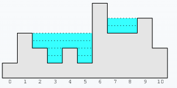

https://app.codility.com/programmers/trainings/1/flood_depth/

You are helping a geologist friend investigate an area with mountain lakes. A recent heavy rainfall has flooded these lakes and their water levels have reached the highest possible point. Your friend is interested to know the maximum depth in the deepest part of these lakes.

We simplify the problem in 2-D dimensions. The whole landscape can be divided into small blocks and described by an array A of length N. Each element of A is the altitude of the rock floor of a block (i.e. the height of this block when there is no water at all). After the rainfall, all the low-lying areas (i.e. blocks that have higher blocks on both sides) are holding as much water as possible. You would like to know the maximum depth of water after this entire area is flooded. You can assume that the altitude outside this area is zero and the outside area can accommodate infinite amount of water.

For example, consider array A such that:

    A[0] = 1
    A[1] = 3
    A[2] = 2
    A[3] = 1
    A[4] = 2
    A[5] = 1
    A[6] = 5
    A[7] = 3
    A[8] = 3
    A[9] = 4
    A[10] = 2
The following picture illustrates the landscape after it has flooded:

The gray area is the rock floor described by the array A above and the blue area with dashed lines represents the water filling the low-lying areas with maximum possible volume. Thus, blocks 3 and 5 have a water depth of 2 while blocks 2, 4, 7 and 8 have a water depth of 1. Therefore, the maximum water depth of this area is 2.

Write a function:

def solution(A)

that, given a non-empty array A consisting of N integers, returns the maximum depth of water.

Given array A shown above, the function should return 2, as explained above.

For the following array:

    A[0] = 5
    A[1] = 8
the function should return 0, because this landscape cannot hold any water.

Write an efficient algorithm for the following assumptions:

N is an integer within the range [1..100,000];
each element of array A is an integer within the range [1..100,000,000].